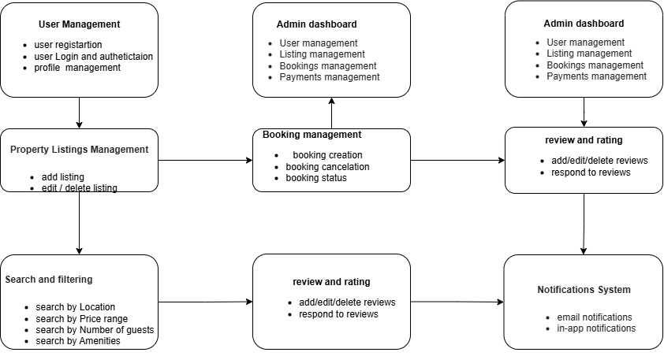

# Features and Functionalities - Airbnb Clone Backend

This document outlines the key features and functionalities supported by the backend of the Airbnb Clone project. The diagram below provides a visual representation of the system modules and their interactions.

## 📂 Diagram
The following diagram shows all major modules and functionalities:

## ✅ Key Modules

### 1. User Management
- User Registration (Guests and Hosts)
- Login & Secure Authentication (JWT, OAuth)
- Profile Management

### 2. Property Listings Management
- Add, Edit, Delete Property Listings
- Manage Amenities and Availability

### 3. Search & Filtering
- Search by Location, Price, Guests, Amenities
- Pagination for large datasets

### 4. Booking Management
- Create, Cancel Bookings
- Prevent double bookings
- Track Booking Status

### 5. Payment Integration
- Secure Payment Gateways (Stripe, PayPal)
- Payouts to Hosts
- Multi-currency Support

### 6. Reviews and Ratings
- Leave and Manage Reviews
- Link reviews to bookings

### 7. Notifications System
- Email & In-App Notifications for bookings, cancellations, and payments

### 8. Admin Dashboard
- Manage Users, Listings, Bookings, Payments

---

**File Generated:** `features-diagram.png`

**Repository:** `alx-airbnb-project-documentation`
