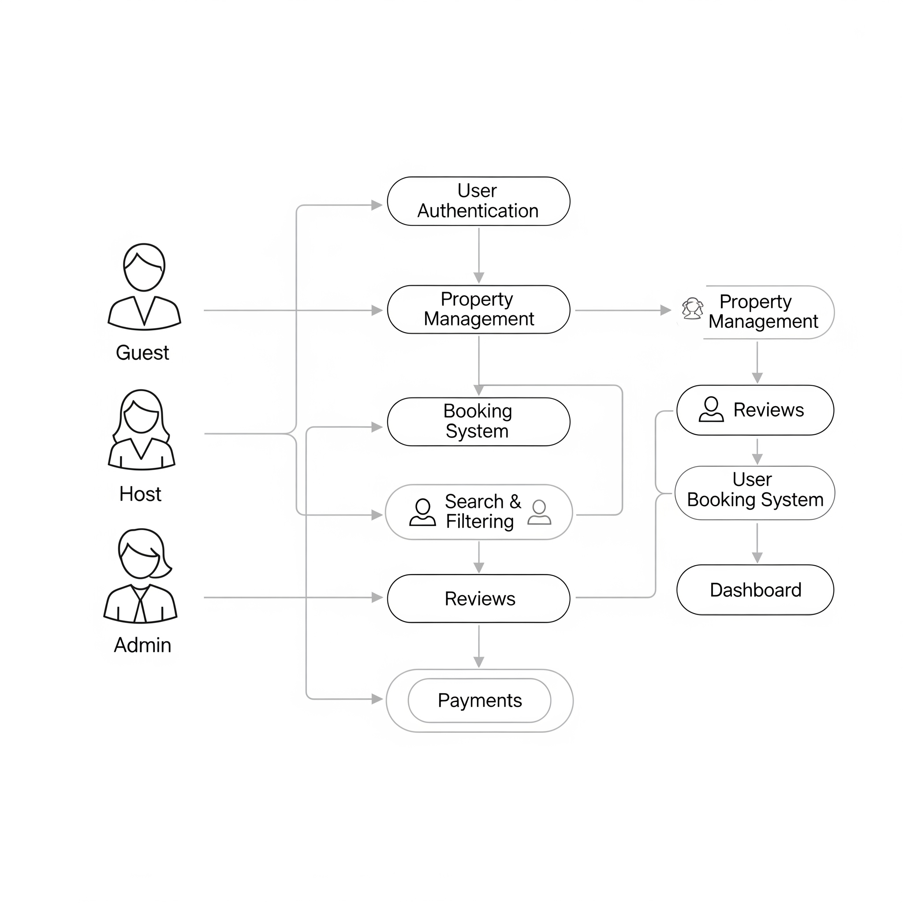

# Use Case Diagram - Airbnb Clone Backend

This diagram represents the interactions between system actors and the key functionalities of the Airbnb Clone backend.

## 📂 Diagram

## ✅ Key Actors
- **Guest**: Registers, searches for properties, books, makes payments, and leaves reviews.
- **Host**: Manages property listings and responds to bookings.
- **Admin**: Monitors and manages users, listings, and payments.
- **Payment Gateway**: Handles secure payment processing.

## ✅ Main Use Cases
1. **User Registration & Login**
2. **Profile Management**
3. **Property Management** (Add, Edit, Delete Listings)
4. **Search & Filtering**
5. **Booking Management** (Create & Cancel Bookings)
6. **Payments** (Secure transactions with external gateways)
7. **Reviews and Ratings**
8. **Admin Management** (Users, Properties, Payments)

